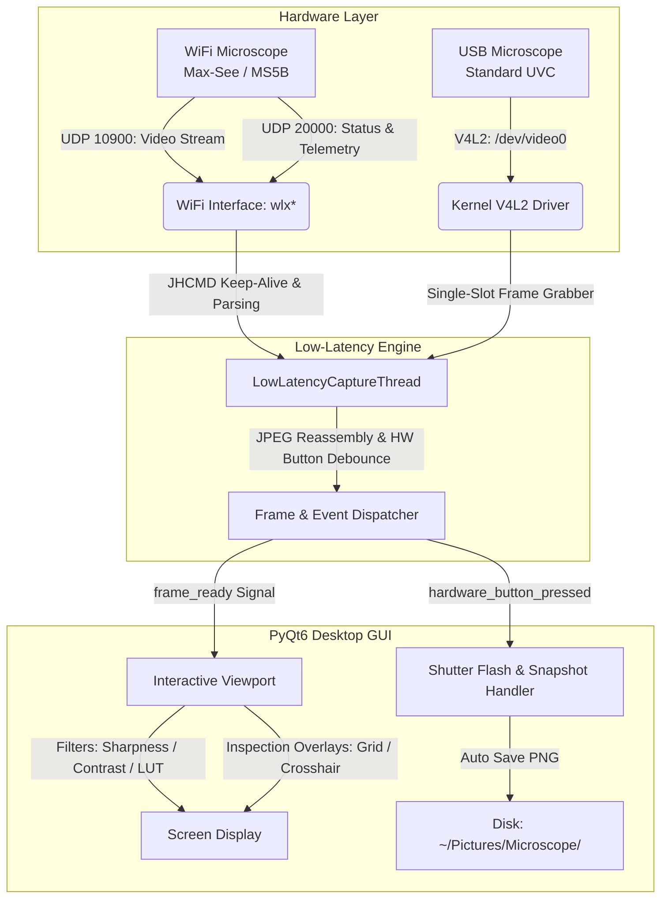

# 🔬 Microscope Viewer Pro (Dual-Mode USB & WiFi)

[](LICENSE)
[](#system-requirements)
[](https://www.python.org/)
[](https://www.riverbankcomputing.com/software/pyqt/)
[](https://opencv.org/)

A high-performance, ultra-low latency desktop inspection viewer and measurement studio designed for **USB (UVC / V4L2)** and **WiFi (JoyHonest / Max-See / MS5B UDP)** digital microscopes on Linux.

---

## ⚡ Highlights

- **Ultra-Low Latency (<35 ms)**: Custom non-blocking UDP stream reassembler delivering rock-solid **20.0 FPS** at 640×480 without buffer lag or frame buildup.
- **Reverse-Engineered JoyHonest UDP Protocol**: Native implementation of the proprietary `JHCMD` protocol eliminating the need for mobile emulators or proprietary apps.
- **Physical Hardware Button Trigger**: Seamless capture triggering when pressing the physical photo button on the microscope barrel, backed by a 350 ms anti-bounce filter and visual shutter flash animation.
- **Dual-Mode Connectivity**: Switch effortlessly between direct USB V4L2 video nodes (`/dev/video*`) and wireless JoyHonest UDP streams (`192.168.29.1`).
- **Auto-Discovery & Connection**: Probes local network interfaces and auto-connects to active microscope access points upon startup.
- **Precision Inspection Overlays**:
  - **Grid**: Adjustable pitch (10 px to 100 px) for metric calibration.
  - **Crosshairs**: Centered optical reference.
  - **Concentric Circles**: Geometric alignment for circular features and bores.
  - **Color Customization**: High-contrast color picker (Lime Green, Neon Cyan, Snagit Red, Electric Yellow, White).
- **Live Image Enhancement**:
  - Unsharp masking sharpness adjustment.
  - Real-time brightness & contrast tuning.
  - Inspection modes: Standard Color, Grayscale, and Color Inversion (darkfield negative).
  - Horizontal & vertical orientation flipping.
- **Interactive Digital Zoom & Pan**: Fluid mouse-wheel zoom (1.0× to 5.0×) and mouse-drag canvas panning.
- **Capture Studio**:
  - Freeze-frame mode (`[F]`) for steady inspection.
  - High-resolution PNG snapshots saved directly to `~/Pictures/Microscope/`.
  - Continuous MP4 video recording with live elapsed timer.

---

## 🏛️ System Architecture



---

## 🔬 Reverse-Engineered JoyHonest Protocol (MS5B)

Generic WiFi digital microscopes (Max-See, Inskam, JoyHonest GP4225/RTPB chipsets) broadcast an open access point (e.g. `wifi-camera-MS5B-xxxx`) on `192.168.29.1` and stream over UDP:

### 1. Command & Control Port (`UDP 20000`)
- Packets begin with the 5-byte magic string `JHCMD`.
- **Initialization Sequence**:
  1. `JHCMD\x10\x00` – Requests telemetry flags and device status.
  2. `JHCMD\x20\x00` – Requests module information (device responds with a 105-byte identity frame containing model string `MS5B`).
  3. `JHCMD\xd0\x01` – Signals video streaming start and registers client endpoint.
- **Keep-Alive Heartbeat**: Client must emit `JHCMD\xd0\x01` every 500 ms to 1000 ms. If the heartbeat drops, the microscope immediately stops transmission.
- **Shutdown**: Emitting `JHCMD\xd0\x02` gracefully halts the stream.

### 2. Video Stream Port (`UDP 10900`)
- Packets arrive in chunks up to 1450 bytes.
- Each packet starts with an **8-byte header**:
  ```text
  [0..1]: 16-bit LE Frame counter
  [2]   : Total packets in current frame
  [3]   : Packet index within frame (0 to total-1)
  [4..5]: 16-bit LE Frame payload size
  [6..7]: Telemetry flags (hardware button state / auxiliary bits)
  [8.. ]: Raw JPEG payload fragment
  ```
- **Frame Reassembly**: When `packet_index == 0` is received, preceding fragments are assembled and decoded via OpenCV `imdecode`. The first packet always begins with the JPEG SOI marker (`\xFF\xD8`).

### 3. Hardware Button Event Detection
- Actuation of the physical button on the microscope barrel generates an asynchronous notification on UDP port `20000` (or toggles flag bytes in the video header).
- A 350 ms software debounce filter prevents multiple triggers caused by mechanical microswitch bounce, executing a clean, single shutter action per actuation.

---

## 💻 System Requirements

- **OS**: Linux (Ubuntu 20.04+, Debian 11+, Fedora 38+, Arch Linux).
- **Python**: 3.10 or newer.
- **Dependencies**:
  - `PyQt6`
  - `opencv-python`
  - `numpy`
  - `netifaces`

---

## 🚀 Installation & Setup

### 1. Clone the Repository
```bash
git clone https://github.com/fbetancourt-dev/microscope-viewer.git
cd microscope-viewer
```

### 2. Set Up Virtual Environment (Recommended)
```bash
python3 -m venv .venv
source .venv/bin/activate
pip install -r requirements.txt
```

### 3. Run the Application
```bash
chmod +x run.sh
./run.sh
```

---

## 🌐 Dual WiFi Adapter Workflow (Recommended)

When working with WiFi digital microscopes, your computer connects to the microscope's ad-hoc access point, which has no internet gateway. To keep normal internet connectivity while streaming video:

1. Keep your primary network interface (e.g., `wlp3s0` or Ethernet) connected to your home/work router.
2. Plug in an inexpensive secondary USB WiFi dongle (e.g., `wlx*`).
3. Connect the secondary adapter to the microscope's SSID (e.g. `wifi-camera-MS5B-bd20`):
   ```bash
   nmcli device wifi connect "wifi-camera-MS5B-bd20" ifname wlx90de805953cb
   ```
4. Linux will automatically route only the microscope subnet (`192.168.29.0/24`) through the secondary dongle, keeping your default route and internet intact on the primary interface.

---

## ⌨️ Keyboard Shortcuts

| Key | Action |
| :--- | :--- |
| **`[Space]`** | Trigger photo snapshot (or start/stop video recording depending on active trigger mode) |
| **`[F]`** | Toggle Freeze-Frame (holds current image for stationary measurement) |
| **`[C]`** | Clear reticle overlays and reset canvas view |
| **`Mouse Wheel`** | Digital zoom in / out (1.0× to 5.0×) centered at cursor |
| **`Left Drag`** | Pan image canvas when zoomed in |
| **`Double Click`** | Reset zoom and recenter canvas |

---

## 🛠️ Diagnostics & Reverse Engineering Suite

A dedicated diagnostic suite and forensic investigation chronicle is documented in the [**`tools/` directory**](tools/README.md):

- **[Forensic Investigation Report](tools/README.md)**: The full technical chronicle documenting our empirical tests on Endpoint `0x81`, the multi-endpoint parallel scan, and the UVC STI Bit 5 video header inspection.
- **`tools/live_button_monitor.py`**: Real-time packet sniffer on UDP ports 20000 and 10900.
- **`tools/usb_endpoint_sniffer.py`**: Linux `usbmon` and active PyUSB polling tool for Endpoint `0x81`.
- **`tools/usb_all_endpoints_scanner.py`**: Parallel listener querying candidate endpoints `0x81` through `0x87` simultaneously.
- **`tools/test_uvc_still_bit.py`**: UVC live video stream packet inspector decoding the `UVC_STREAM_STI` flag.

---

## 📚 Hardware Hacking, Bootloader & Protocol Documentation

Detailed reverse engineering guides, silicon architecture analyses, hardware pinouts, and network specifications are documented in the [**`docs/` directory**](docs/):

1. **[Hardware Reverse Engineering & Silicon Architecture](docs/HARDWARE_REVERSE_ENGINEERING.md)**
   - Complete block diagrams, component breakdown (Generalplus ARM SoC, 8× SMD LEDs, LiPo battery charging).
   - Analysis of SPI NOR Flash layout and ARM vector table opcode leak (`ldr pc, [pc, #20]`).
   - Deep dive into why the physical button does not trigger `/dev/input` over USB (`bmCapabilities 0x02: Still image unsupported`).
2. **[Bootloader & Firmware Hacking Guide](docs/BOOTLOADER_AND_FIRMWARE_GUIDE.md)**
   - Analysis of why WiFi OTA updates are not supported by the Joyhonest appliance model.
   - **Method 1: Generalplus Mask ROM USB ISP Mode** (forcing bootloader via SPI `/CS` ground trigger).
   - **Method 2: In-Circuit SPI Flash Dumping / Flashing** (CH341A, SOIC-8 clip, and `flashrom` step-by-step).
   - **Method 3: Internal UART Serial Console** (test pads, 115200 8N1 baud, bootloader CLI access).
3. **[JoyHonest JHCMD Protocol Specification](docs/PROTOCOL_SPECIFICATION.md)**
   - Formal specification of the dual-port UDP protocol (UDP 20000 control, UDP 10900 RTP-like video).
   - Complete packet binary format diagrams and handshake sequence.
   - Exact hardware button codes: `b'JHCMD\x00\x01'` (Photo snapshot), `b'JHCMD\x00\x02'` (Video recording toggle), `b'JHCMD\x00\x00'` (Release).
4. **Hardware Datasheets & Reference Pinouts:**
   - **[Winbond W25Q16 / W25Q32 SPI NOR Flash Datasheet Summary](docs/datasheets/WINBOND_W25QXX_SPI_FLASH.md)**: SOIC-8 pinout, electrical specs, SPI instruction opcodes.
   - **[CH341A USB Programmer Hardware Reference](docs/datasheets/CH341A_PROGRAMMER_PINOUT.md)**: 3.3V logic level fix, ZIF socket pinout, SOIC-8 clip wiring matrix.
   - **[Generalplus GP/GPCV Multimedia SoC Reference](docs/datasheets/GENERALPLUS_SOC_REFERENCE.md)**: Architecture block diagram, boot phases, and ISP recovery mode.

---

## 📄 License

This project is licensed under the [MIT License](LICENSE) © 2026 Francisco Betancourt.
