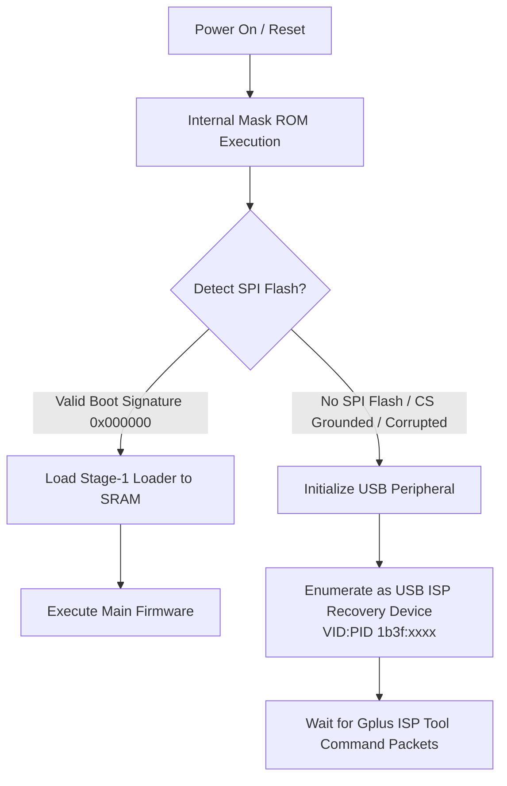

# 🛠️ Bootloader & Firmware Hacking Guide: MS5 / MS5B Digital Microscope

This guide provides technical procedures for accessing the bootloader, dumping the original firmware, flashing modified binaries, and interacting with the internal serial console of the **MS5 / MS5B Digital Microscope**.

---

## ⚠️ Executive Summary: WiFi vs. Hardware Bootloader

| Method | Status | Feasibility | Description |
| :--- | :--- | :--- | :--- |
| **WiFi OTA Bootloader** | ❌ Not Available | Impossible | The Joyhonest `JHCMD` protocol does not implement OTA firmware flash commands. Companion apps (*Max-See*, *HiView*, *DLscope*) contain zero OTA code. |
| **USB Mask ROM ISP Mode** | 🟡 Hardware-Assisted | Moderate | Generalplus SoCs contain an on-chip Mask ROM USB bootloader invoked by pulling SPI Flash `/CS` to GND at boot. |
| **Direct SPI Flash Programmer** | ✅ Recommended | 100% Reliable | Reading/writing the SOIC-8 SPI Flash chip directly using a CH341A programmer and SOIC-8 test clip via `flashrom`. |
| **Internal UART Serial Console** | ✅ Interactive Shell | Easy | Accessing internal PCB test pads (`TX`, `RX`, `GND`) at 115200 baud for boot logs and shell commands. |

---

## 🔌 Method 1: Direct In-Circuit SPI Flash Dumping / Flashing (Recommended)

This is the cleanest, non-destructive method to extract a complete 1:1 image of the factory firmware or flash custom modifications.

### Required Equipment:
1. **CH341A USB Programmer** (Black or Green PCB) or a Raspberry Pi / ESP32 running SPI flash programmer firmware.
2. **SOIC-8 Pomona Test Clip** with ribbon cable.
3. Multimeter (to verify pinout and 3.3V supply voltage).

> [!CAUTION]
> **CH341A 3.3V Voltage Warning:**
> Many cheap "Black Edition" CH341A programmers have a design flaw where the data pins supply 5V logic even when the jumper is set to 3.3V. Ensure your CH341A is modified for true 3.3V logic (lifting pin 28 and jumping to pin 9 3.3V LDO) to prevent damaging the 3.3V SPI Flash chip.

### SOIC-8 Pinout Reference

```text
                  Winbond / GigaDevice SOIC-8 Top View
                              +---v---+
           (Chip Select) /CS -| 1   8 |- VCC (3.3V DC)
      (Serial Data Out) MISO -| 2   7 |- /HOLD (Leave floating or pull up)
         (Write Protect) /WP -| 3   6 |- CLK (Serial Clock)
                    (Ground) -| 4   5 |- MOSI (Serial Data In)
                              +-------+
```

### Wiring Matrix to CH341A:

| SOIC-8 Pin | Signal Name | CH341A Header Pin | Note |
| :---: | :---: | :---: | :--- |
| **1** | `/CS` | `CS` | Active low chip select |
| **2** | `MISO` (`DO`) | `MISO` | Data from Flash to Programmer |
| **3** | `/WP` | `3.3V` or NC | Write Protect (high = writes allowed) |
| **4** | `GND` | `GND` | Common Ground |
| **5** | `MOSI` (`DI`) | `MOSI` | Data from Programmer to Flash |
| **6** | `CLK` | `CLK` | SPI Clock output |
| **7** | `/HOLD` | `3.3V` or NC | Must not be tied to GND |
| **8** | `VCC` | `3.3V` | Supply power (Do NOT supply 5V!) |

### Step-by-Step Dumping Procedure using `flashrom`:

1. **Power off the microscope** and disconnect the USB cable and internal battery connector if accessible.
2. **Attach the SOIC-8 clip** firmly to the flash chip, ensuring pin 1 (marked by a circular indentation on the IC) aligns with red pin 1 on the clip.
3. Plug the CH341A programmer into your Linux PC.
4. Verify detection:
   ```bash
   flashrom -p ch341a_spi
   ```
   *Expected output:* `Found Winbond flash chip "W25Q16.V" (2048 kB, SPI) on ch341a_spi.`
5. **Read and dump the flash image twice** to verify integrity:
   ```bash
   flashrom -p ch341a_spi -r backup_pass1.bin
   flashrom -p ch341a_spi -r backup_pass2.bin
   ```
6. **Compare checksums:**
   ```bash
   diff -s backup_pass1.bin backup_pass2.bin
   sha256sum backup_pass1.bin backup_pass2.bin
   ```
   *If the files are identical, your firmware backup is safe and verified!*

### Step-by-Step Flashing Procedure:
```bash
# Write new firmware with automated verification:
flashrom -p ch341a_spi -w modified_firmware.bin
```

---

## ⚡ Method 2: Generalplus Mask ROM USB ISP Recovery Mode

Generalplus SoCs (such as GP3285 / GPCV / GP22 series) feature an internal, un-brickable Mask ROM bootloader. 

### Boot Sequence:


### Triggering ISP Mode via Hardware Test Point:
1. Locate the SPI Flash chip on the internal PCB.
2. Using fine tweezers or a 100Ω resistor, bridge **Pin 1 (`/CS`)** or **Pin 5 (`MOSI`)** to **GND (Pin 4)**.
3. While holding the bridge, plug the USB cable into your PC.
4. Release the bridge after 1 second.
5. Check `dmesg -w` or `lsusb`:
   - The device will **not** appear as `1b3f:2002 808 Camera`.
   - Instead, it enumerates as a Generalplus ISP device (e.g. `1b3f:1001` or `1b3f:0c01`).
6. In this mode, PC utility tools (`gp_isp` or vendor `Gplus_ISP_Tool.exe`) can directly upload a stage-1 bootloader into internal SRAM and reprogram the SPI Flash without opening the chip package.

---

## 📟 Method 3: Internal UART Serial Console

On the internal PCB, manufacturers almost universally leave test pads for factory quality assurance (QA) and serial diagnostics.

### Locating the UART Pads:
1. Look for 3 or 4 circular gold test pads grouped together, often labelled `TX`, `RX`, `GND` or `TP1`, `TP2`, `TP3`.
2. Connect a 3.3V USB-to-UART bridge (e.g., FT232RL, CP2102, or Raspberry Pi Pico):
   - `GND` -> Microscope `GND`
   - `RXD` -> Microscope `TX`
   - `TXD` -> Microscope `RX` (through a 1kΩ protective resistor)

### Opening the Terminal:
```bash
picocom -b 115200 /dev/ttyUSB0 --flow n
```
*(Alternative: `minicom -D /dev/ttyUSB0 -b 115200`)*

### What to Expect on Boot:
* Bootloader banner (e.g., Generalplus Bootloader v1.x or U-Boot-spl).
* Clock configuration (PLL frequencies for ARM core, DSP, and DDR/PSRAM).
* Sensor initialization (`OV9712 / GC1054 / SC1243 detected`).
* WiFi module initialization (`JH_WIFI initialization OK, IP: 192.168.29.1`).
* Shell prompt (`[GP-SHELL]#` or RTOS console) allowing memory inspection (`md`), memory modification (`mm`), and register reads.
