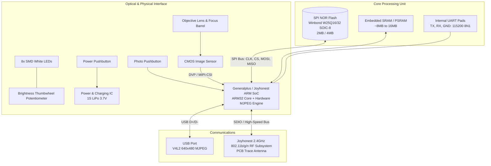

# 🔬 Hardware Reverse Engineering: MS5 / MS5B Digital Microscope

This document details the internal hardware architecture, silicon components, memory layout, USB descriptors, and wireless subsystems of the **MS5 / MS5B Digital WiFi & USB Microscope**.

---

## 📋 Device Specifications

| Parameter | Specification |
| :--- | :--- |
| **Commercial Model** | MS5 / MS5B Digital Microscope (OEM: Shenzhen Joyhonest Technology Co., Ltd.) |
| **USB Identity** | `1b3f:2002 Generalplus Technology Inc. 808 Camera` |
| **WiFi Access Point** | `wifi-camera-MS5B-xxxx` (BSSID OUI prefix: `50:9B:94` Joyhonest) |
| **Default IP Subnet** | `192.168.29.0/24` (Microscope gateway: `192.168.29.1`) |
| **Camera Sensor** | 1/4" CMOS Image Sensor (~1.0 MP native) |
| **Optics** | Manual focus ring (barrel zoom 50× – 1000× optical range) |
| **Illumination** | 8× SMD White LEDs with analog thumbwheel potentiometer |
| **Battery / Power** | 3.7V 800mAh 1S Lithium-Polymer (LiPo) with internal charging controller |
| **External Controls** | Power Pushbutton, Photo/Capture Pushbutton, LED Dimmer Thumbwheel, USB Micro-B/Type-C |

---

## 🏗️ Hardware Architecture & System Block Diagram



---

## 🔍 Silicon Components & Teardown Analysis

### 1. Main System-on-Chip (SoC)
* **Architecture:** 32-bit ARM (ARM926EJ-S or ARM7EJ-S core architecture).
* **Manufacturer Family:** Generalplus Technology (GP series) / Joyhonest customized solution.
* **Integrated Peripherals:**
  - CMOS Sensor Interface (DVP 8-bit / MIPI CSI-2).
  - Hardware MJPEG JPEG compression engine (real-time 30 FPS encoder).
  - USB 2.0 Full-Speed / High-Speed OTG controller.
  - SPI Master controller (for boot SPI Flash).
  - SDIO / SPI interface to 2.4 GHz 802.11n baseband.
  - UART serial port (for kernel/RTOS bootloader debugging).

### 2. Firmware Storage: SPI NOR Flash
* **Package:** SOIC-8 (150mil or 208mil pitch).
* **Common Part Numbers:** Winbond `W25Q16JV` (16 Mbit / 2 MB) or `W25Q32JV` (32 Mbit / 4 MB), GigaDevice `GD25Q16`, XTX `XT25F16`.
* **Standard SOIC-8 Pinout:**
  ```text
            +---v---+
      /CS  -| 1   8 |- VCC (3.3V)
     MISO  -| 2   7 |- /HOLD (IO3)
      /WP  -| 3   6 |- CLK
      GND  -| 4   5 |- MOSI (IO0)
            +-------+
  ```
* **Boot Role:** When the SoC boots from internal ROM, it queries address `0x000000` of this SPI flash over SPI Mode 0 to load the stage-1 bootloader into internal SRAM.

### 3. Firmware Leak Analysis from UDP Telemetry
During the reverse engineering of the WiFi status packets on UDP port `20000`, the microscope responded to command `JHCMD\x20\x00` with a 105-byte frame. The trailing 32 bytes contain literal leaked ARM vector opcodes from the microcontroller's reset exception vectors:

```text
Hex Payload Dump:
4a 48 43 4d 44 20 00 61 00 00 00 00 ... 4d 53 35 42 ('MS5B') ...
... f0 9f e5 fe ff ff ea 14 f0 9f e5 14 f0 9f e5 64 ...
```

Disassembling the trailing 32-bit words:
* `f0 9f e5` (`0xE59FF0...` in Little Endian): ARM instruction `ldr pc, [pc, #offset]` (Standard ARM vector jump table).
* `fe ff ff ea` (`0xEAFFFFFE`): ARM instruction `b .` (infinite spin-loop / exception trap).
* `14 f0 9f e5` (`0xE59FF014`): ARM instruction `ldr pc, [pc, #20]` (Interrupt service routine redirection).

This confirms a bare-metal RTOS (such as uC/OS-II or FreeRTOS) executing in 32-bit ARM mode without an MMU, running directly from mapped SPI flash / internal SRAM.

---

## 🔌 USB Mode Analysis: Why the Button Doesn't Trigger `/dev/input`

When connected via USB to a Linux host, `lsusb` registers:
```text
Bus 001 Device 012: ID 1b3f:2002 Generalplus Technology Inc. 808 Camera
```

Interrogating the USB descriptor via `lsusb -v -d 1b3f:2002` reveals:
```text
  VideoControl Interface Descriptor:
    bLength                26
    bDescriptorType        36
    bDescriptorSubtype      2 (INPUT_TERMINAL)
    bTerminalID             1
    wTerminalType      0x0201 Camera Sensor
  VideoControl Interface Descriptor:
    bLength                 9
    bDescriptorType        36
    bDescriptorSubtype      3 (OUTPUT_TERMINAL)
    bTerminalID             2
    wTerminalType      0x0101 TT_STREAMING
  VideoControl Interface Descriptor:
    bLength                11
    bDescriptorType        36
    bDescriptorSubtype      5 (PROCESSING_UNIT)
    bmVideoStandards     0x00
    bmCapabilities       0x02: Still image unsupported
```

### The Root Cause:
1. **Missing Still Image Method 1/2:** The UVC VideoControl descriptor explicitly reports `bmCapabilities 0x02: Still image unsupported`. It does **not** declare an Interrupt Endpoint (`0x83 Interrupt IN`) for hardware button events.
2. **Missing HID / Input Descriptor:** The USB interface contains only two interfaces: `Interface 0: VideoControl` and `Interface 1: VideoStreaming`. There is no HID (Human Interface Device) profile.
3. **Firmware Routing in USB Mode:** In USB mode, the Generalplus firmware prioritizes simple UVC webcam streaming and does not route GPIO pin changes from the photo button to the USB endpoints.

---

## 📶 WiFi Mode Analysis: Complete Freedom & Full Button Integration

In WiFi mode, the microscope switches to its Joyhonest wireless stack:
* **Resolution:** Streams at **1280×720 (720p HD)** or **640×480**, depending on requests.
* **Control Channel (UDP 20000):** Provides direct, bi-directional telemetry.
* **Hardware Button Event Stream:** The SoC's GPIO ISR directly formats and transmits UDP packets to the host on port `20000`:
  - `b'JHCMD\x00\x01'`: Short click -> Snapshot.
  - `b'JHCMD\x00\x02'`: Long click -> Video toggle.
  - `b'JHCMD\x00\x00'`: Button release.

This enables full physical button integration without needing kernel drivers or USB input event devices.
