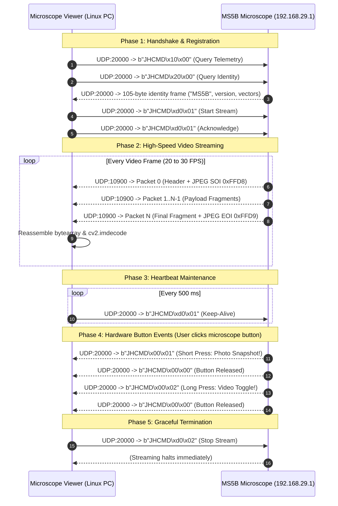

# 📡 Network Protocol Specification: JoyHonest JHCMD (MS5B)

This document formalizes the reverse-engineered network protocol used by the **Shenzhen Joyhonest MS5B** digital microscope over 802.11b/g/n WiFi.

---

## 🌐 Network Topology & IP Configuration

* **Microscope AP SSID**: `wifi-camera-MS5B-xxxx` (Unencrypted open network or WPA2-PSK).
* **Microscope Gateway IP**: `192.168.29.1`
* **DHCP Lease Range**: `192.168.29.2` to `192.168.29.254` (Netmask `/24`, Subnet `255.255.255.0`).
* **Active Ports**:
  - `UDP 20000`: Bi-directional Command, Telemetry & Hardware Button Port.
  - `UDP 10900`: Inbound RTP-like JPEG Frame Chunk Stream Port.
  - `TCP 8081`: Secondary control / proprietary link.

---

## 🔁 Complete Session Sequence Diagram



---

## 📦 Packet Binary Formats

### 1. Command Datagrams (UDP 20000)

All command packets transmitted to the microscope have a minimum size of 7 bytes:

```text
 0                   1                   2                   3
 0 1 2 3 4 5 6 7 8 9 0 1 2 3 4 5 6 7 8 9 0 1 2 3 4 5 6 7 8 9 0 1
+-+-+-+-+-+-+-+-+-+-+-+-+-+-+-+-+-+-+-+-+-+-+-+-+-+-+-+-+-+-+-+-+
|       'J'     |      'H'      |      'C'      |      'M'      |
+-+-+-+-+-+-+-+-+-+-+-+-+-+-+-+-+-+-+-+-+-+-+-+-+-+-+-+-+-+-+-+-+
|       'D'     |  Opcode (Cmd) |  Sub-Code     |
+-+-+-+-+-+-+-+-+-+-+-+-+-+-+-+-+-+-+-+-+-+-+-+-+
```

| Magic Prefix (`5B`) | Opcode | Sub-Code | Description | Direction |
| :---: | :---: | :---: | :--- | :---: |
| `JHCMD` (`4a 48 43 4d 44`) | `\x10` | `\x00` | Query status / connection state | App -> Scope |
| `JHCMD` (`4a 48 43 4d 44`) | `\x20` | `\x00` | Request device identity profile | App -> Scope |
| `JHCMD` (`4a 48 43 4d 44`) | `\xd0` | `\x01` | **Start stream / Heartbeat keepalive** (must repeat every 500ms) | App -> Scope |
| `JHCMD` (`4a 48 43 4d 44`) | `\xd0` | `\x02` | **Stop video stream** | App -> Scope |
| `JHCMD` (`4a 48 43 4d 44`) | `\x00` | `\x01` | **Hardware Button: Short Click (Photo Snapshot)** | **Scope -> App** |
| `JHCMD` (`4a 48 43 4d 44`) | `\x00` | `\x02` | **Hardware Button: Long Click (Video Toggle)** | **Scope -> App** |
| `JHCMD` (`4a 48 43 4d 44`) | `\x00` | `\x00` | **Hardware Button: Key Release** | **Scope -> App** |

---

### 2. Video Stream Datagrams (UDP 10900)

The video stream packets arrive on UDP port `10900` with an **8-byte binary header** followed by the JPEG fragment payload:

```text
 0                   1                   2                   3
 0 1 2 3 4 5 6 7 8 9 0 1 2 3 4 5 6 7 8 9 0 1 2 3 4 5 6 7 8 9 0 1
+-+-+-+-+-+-+-+-+-+-+-+-+-+-+-+-+-+-+-+-+-+-+-+-+-+-+-+-+-+-+-+-+
|          Frame ID (16-bit LE)         | Total Packets | Packet Index  |
+-+-+-+-+-+-+-+-+-+-+-+-+-+-+-+-+-+-+-+-+-+-+-+-+-+-+-+-+-+-+-+-+
|       Payload Length (16-bit LE)      |  Reserved/Flag|  Reserved/Flag|
+-+-+-+-+-+-+-+-+-+-+-+-+-+-+-+-+-+-+-+-+-+-+-+-+-+-+-+-+-+-+-+-+
|                                                               |
|                   Raw JPEG Payload Fragment                   |
|                      (Up to 1442 bytes)                       |
|                                                               |
+-+-+-+-+-+-+-+-+-+-+-+-+-+-+-+-+-+-+-+-+-+-+-+-+-+-+-+-+-+-+-+-+
```

#### Field Definitions:
* **Frame ID (`bytes 0..1`)**: 16-bit unsigned little-endian integer. Increments with every full video frame (0 to 65535, rolls over).
* **Total Packets (`byte 2`)**: Total count of packets making up this frame (typically 8 to 25 packets depending on scene complexity).
* **Packet Index (`byte 3`)**: 0-indexed fragment number (`0` = first packet containing JPEG Start of Image `\xFF\xD8`).
* **Payload Length (`bytes 4..5`)**: Size of the payload segment in bytes.
* **Flags (`bytes 6..7`)**: Auxiliary hardware status indicators.
* **Payload (`bytes 8..End`)**: Raw JPEG bytes.

---

## 🔀 Multi-NIC Dual WiFi Routing Setup

To use a secondary USB WiFi dongle (`wlx*`) exclusively for the microscope while retaining primary WiFi (`wlp*`) internet access:

1. **Verify Interface Routing Priorities**:
   ```bash
   ip route show
   ```
2. Ensure the primary internet interface has a **lower metric** (higher priority, e.g., metric 600) than the microscope interface (e.g., metric 20601).
3. The Linux kernel will automatically route `192.168.29.0/24` packets out through `wlx*` and all default internet traffic through `wlp*`.
