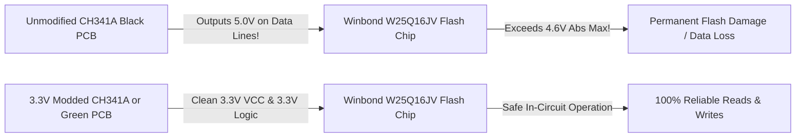

# 🔌 Hardware Reference: CH341A USB SPI/I2C Programmer

This reference document details the pinout, jumper configurations, 3.3V logic level safety, and hookup procedures for using the ubiquitous **CH341A USB Programmer** to dump and flash the microscope's SPI Flash memory.

---

## ⚠️ Critical Warning: 3.3V Logic Level Modification

The vast majority of generic "Black Edition" CH341A programmers sold online have a known hardware flaw:
* **The Problem:** The board's VCC jumper supplies 3.3V to the chip's power pin, but the **data lines (MOSI, MISO, CLK, CS) remain tied directly to the 5V USB rail**.
* **The Consequence:** Driving 5.0V logic into a 3.3V rated SPI NOR Flash (like the Winbond W25Q16/W25Q32, which has an absolute maximum rating of 4.6V) can permanently degrade or destroy the chip.



### How to Fix / Verify 3.3V on the CH341A:
1. Measure voltage with a multimeter between `Pin 4 (GND)` and `Pin 6 (CLK)` while the programmer is plugged in.
2. If it measures ~5.0V, perform the standard 3.3V mod:
   - Lift **Pin 28 (VCC)** of the CH341A IC from the board.
   - Solder a bodge wire connecting Pin 28 directly to the 3.3V output pin of the on-board AMS1117-3.3 regulator (or Pin 9 of the CH341A).

---

## 📌 ZIF Socket & 25xx SPI Pinout

The CH341A has a 16-pin ZIF (Zero Insertion Force) lever socket divided into two zones:

```text
                     CH341A ZIF Lever Side (Handle at top)
                                 [LEVER]
                        +----------------------+
                        |  (1)  [ ]  [ ]  (16) |  <-- 24xx I2C EEPROM Area
                        |  (2)  [ ]  [ ]  (15) |
                        |  (3)  [ ]  [ ]  (14) |
                        |  (4)  [ ]  [ ]  (13) |
                        +----------------------+
                        |  (5)  [ ]  [ ]  (12) |  <-- 25xx SPI FLASH Area (USED HERE!)
               CS  -->  |  (6)  [ ]  [ ]  (11) |  <-- CLK
             MISO  -->  |  (7)  [ ]  [ ]  (10) |  <-- MOSI
              GND  -->  |  (8)  [ ]  [ ]  (9)  |  <-- VCC (3.3V)
                        +----------------------+
```

### Connecting the SOIC-8 Test Clip to the CH341A:

Most SOIC-8 test clips come with an adapter PCB that plugs directly into the **25xx bottom section** of the ZIF socket.

| Flash Pin (SOIC-8) | Signal | ZIF Pin Position | Color (Standard Ribbon) |
| :---: | :---: | :---: | :--- |
| **Pin 1** | `/CS` | 25xx Pin 1 | **Red Line (Pin 1 Indicator)** |
| **Pin 2** | `MISO` (`DO`) | 25xx Pin 2 | Brown |
| **Pin 3** | `/WP` | 25xx Pin 3 | Orange |
| **Pin 4** | `GND` | 25xx Pin 4 | Yellow |
| **Pin 5** | `MOSI` (`DI`) | 25xx Pin 5 | Green |
| **Pin 6** | `CLK` | 25xx Pin 6 | Blue |
| **Pin 7** | `/HOLD` | 25xx Pin 7 | Purple |
| **Pin 8** | `VCC` (3.3V) | 25xx Pin 8 | Grey |

---

## 🛠️ Linux Commands using `flashrom`

### 1. Install `flashrom`:
```bash
sudo apt update && sudo apt install -y flashrom
```

### 2. Probe and Identify Chip:
```bash
flashrom -p ch341a_spi
```

### 3. Read / Dump Firmware:
```bash
# Read full flash image into local binary:
flashrom -p ch341a_spi -r factory_microscope_firmware.bin
```

### 4. Write / Flash Firmware:
```bash
# Erase, write, and verify in one operation:
flashrom -p ch341a_spi -w new_microscope_firmware.bin
```
