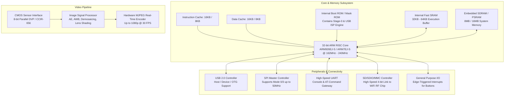

# 📄 Architecture Reference: Generalplus GP/GPCV Series Multimedia SoCs

This document summarizes the internal architecture, memory map, boot phases, and peripheral organization of **Generalplus Technology** multimedia processors (such as the GP3285xx / GPCV / GP22 series) utilized in consumer digital microscopes, dashcams, and Joyhonest wireless camera modules.

---

## 🏛️ SoC Architectural Block Diagram

---

## 🚀 Boot Order & Stage Hierarchy

Generalplus SoCs follow a strict hardware-defined boot sequence execution:

1. **Stage 0: On-Chip Mask ROM Execution**
   - Hard-coded at the silicon foundry; cannot be erased or modified.
   - Sets up initial system clocks, disables watchdog timers, and initializes the SPI master peripheral.
   - Asserts `/CS` on the external SPI Flash bus and attempts to read byte `0x000000`.

2. **Stage 1: External SPI Flash Verification**
   - Reads the first 512 bytes of external SPI Flash looking for the Generalplus boot signature (`GPLUS` or proprietary magic word).
   - If the signature is valid, it copies the Stage-1 bootloader into internal SRAM and transfers execution control.
   - If the SPI Flash is unreadable (e.g. `/CS` is held to GND) or corrupt, the Mask ROM automatically enters **USB ISP Recovery Mode**.

3. **Stage 2: Main RTOS & Video Engine Initialization**
   - The Stage-1 loader initializes external SDRAM / PSRAM.
   - Copies the main RTOS image (uC/OS-II or FreeRTOS) into memory.
   - Initializes sensor clock (MCLK), starts the video pipeline, and boots the Joyhonest networking stack.

---

## 💻 USB ISP Bootloader Protocol

When forced into ISP mode (by holding SPI `/CS` to GND during USB cable attachment):
* **USB Vendor ID (VID)**: `0x1B3F` (Generalplus Technology Inc.)
* **USB Product ID (PID)**: Varies by chip family (typically `0x1001`, `0x0C01`, or `0x2002` in ISP mode).
* **Communication Interface**: Raw Bulk IN/OUT transfer endpoints.
* **Capabilities**:
  - Direct read/write access to internal SRAM address space.
  - Direct SPI Flash read, chip erase, block erase, and page programming without operating system intervention.
